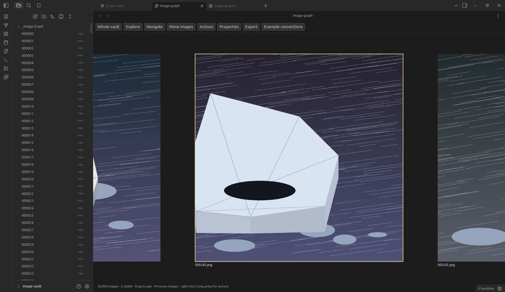
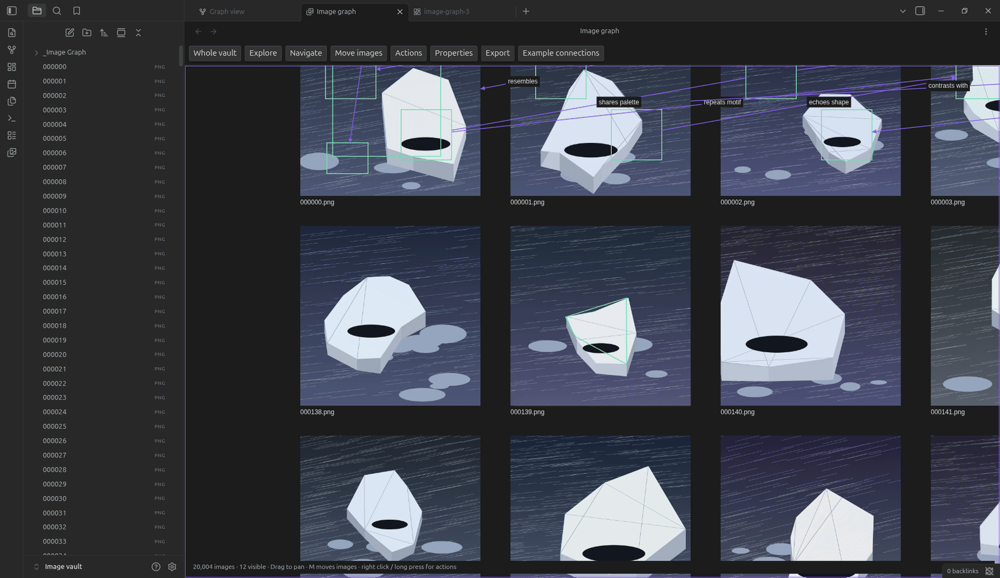
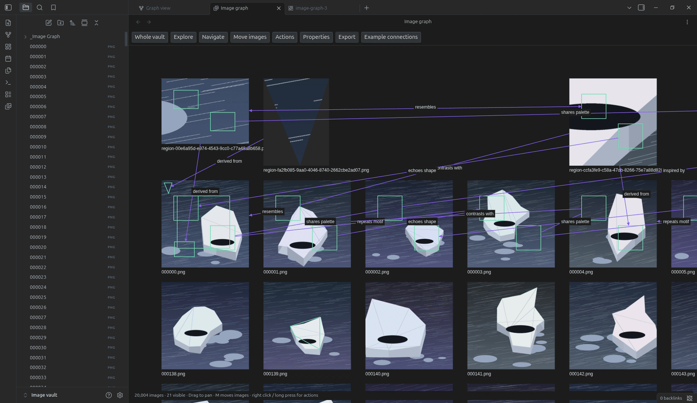
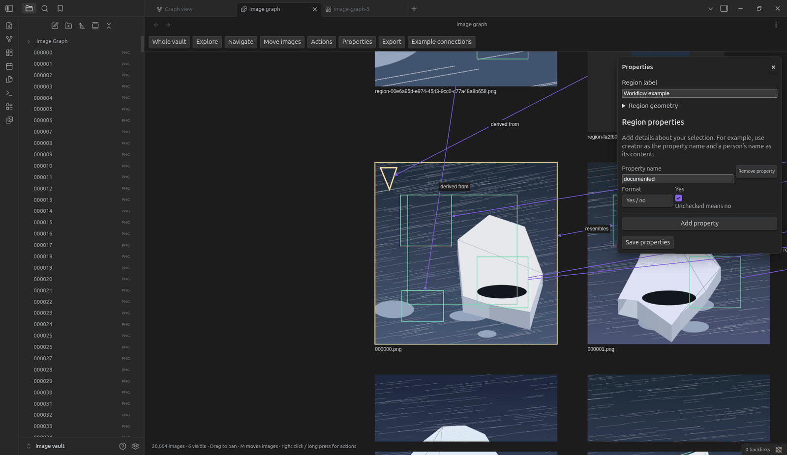

# Workflow recordings

These recordings use the installed plugin and generated images in the authorized
Image vault. Each clip is a sequence of real application states. Each step below
was checked against the saved record, not against the button that caused it.

`workflows.gif` is the README's clip: the first four workflows below, joined in
order, one frame per state. Build it from the same frames with `--crop` set to
the plugin pane. Every clip here is the uncropped window.

## Draw a region on an image



1. Right click the image.
2. Select **Draw rectangle region**.
3. Drag across the part you want. The outline follows the pointer.
4. Enter a name in **Region label**.
5. Select **Save properties**.

The drag is one continuous gesture. Its four sampled frames all report the
region drag, and the saved shape matches the drag: `x 0.240`, `y 0.519`,
`width 0.479`, `height 0.320`. The label reads `Dark water` in the record.

A region stays inside its parent image. It does not become a separate image.

## Make an image from a region


1. Right click inside the region.
2. Select **Create image from region**.
3. Scroll out to see the result.

The plugin writes the crop to `_Image Graph/Extracted/`, gives it a companion
note with `source_image` and `source_region`, and writes a `derived from`
connection back to the region. The catalog went from 20,004 to 20,005 images.
The last frames show the new image above the image it came from, with that
connection between them.

## Connect two images



1. Select the first image.
2. Right click it and select **Connect from here**.
3. Select the second image. The status bar reads `Choose target` until you do.
4. In **Connection details**, replace the content of `relation`.
5. Select **Save properties**.

The new connection starts with the relation `related to`. The recording
replaces it with `same lighting`, which the saved edge record then holds. The
`relation` text is the label beside the line.

## Explore connections



1. Right click an image.
2. Select **Explore connections**.
3. Set **Connection depth** to **2 hops**.
4. Select another image to trace its path.

One hop shows 7 images. Two hops shows 11. The path panel then reports one
shortest path of 2 hops and names each link. The starting image keeps its ring
while the exploration is open.

## Add details to a region



1. Select a region.
2. Select **Properties**.
3. Under **Region properties**, select **Add property**.
4. Enter `description` in **Property name**.
5. Keep **Format** set to **Text**.
6. Enter a description in **Content**.
7. Select **Save properties**.

The recording uses `A triangular detail` as its description. The saved region
record was checked after the save. Image details and connection details use the
same builder. No YAML syntax is required.

This clip is older than the other four. It drove the real properties panel
through automated DOM controls, not through the trusted input described below.
Its states are real; its input was not.

## Capture recipe

The local setup uses Obsidian 1.13.7, its CLI, ffmpeg, and ImageMagick.
Recording tools are development tools, not plugin dependencies.

Before recording, open the authorized vault and install the production build.
Use command-first syntax:

```sh
obsidian plugin:reload vault='Image vault' id=image-graph
obsidian command vault='Image vault' id=image-graph:open
```

Through an execution tool, enable its terminal option (`tty: true`). The
Flatpak wrapper can otherwise return no useful output.

Use a shared workspace directory for screenshots. Obsidian's `/tmp` can differ
from the agent's `/tmp`. Create the directory first.

```sh
obsidian dev:screenshot vault='Image vault' path='/absolute/shared/workspace/capture/frame-0001.png'
```

### Send real input through the debug protocol

Dispatch pointer, wheel, and key events with `dev:cdp`:

```sh
obsidian dev:cdp vault='Image vault' method='Input.dispatchMouseEvent' \
  params='{"type":"mousePressed","x":700,"y":950,"button":"left","buttons":1,"clickCount":1}'
```

The canvas receives these as trusted events with `pointerType: "mouse"`. They
are not synthetic DOM events.

A gesture survives across separate CLI calls. Measured on 2026-09-20: a pan of
press, two moves, and release, sent as four calls, moved the camera by exactly
the 60 pixels of the moves. A region drag sampled at four points reported the
region drag at every sample, and produced a shape that matches the drag. So you
can screenshot in the middle of a drag.

A `<select>` also takes real keyboard input. Focus it, then send `ArrowDown`;
the control changes its value and fires its change event.

### Check completion, not command return

An evaluation can return before asynchronous work finishes. Store the result on
a temporary global, then read it in a later call. Check the saved record as
well as the screenshot. Restore temporary instrumentation after the check.

`ImageGraphView.debugState()` returns the camera, the selection, the mode, and
the exploration. Every step in these clips was confirmed through it.

### Hold a state and remove the tooltip

Copy a frame to hold its state. The converter runs at a constant rate, so two
copies of one frame hold it for two frame times.

Obsidian shows the canvas `aria-label` as a tooltip when the pointer rests. The
pause between CLI calls is an effect of capture, not of the gesture, so the
recorder removes that tooltip element before each screenshot. Nothing else in
the interface is changed.

Park the pointer outside the canvas between actions. Inside a drag you cannot,
which is why the tooltip has to go.

### Encode and review

From the plugin directory, convert the frames:

```sh
node scripts/capture-workflows.mjs \
  --workflow region \
  --frames /absolute/shared/workspace/capture \
  --output docs/workflows/region.gif \
  --fps 2.5 --width 1600
```

The rate of 2.5 frames per second holds each frame for 0.4 seconds. Add
`--crop W:H:X:Y` to trim window chrome, as the README clip does.

The converter also writes a contact sheet beside the GIF. Review it for stale
controls, failed steps, and unrelated windows, then read the full-size frames
for anything the small images cannot show. Contact sheets and rejected
recordings are review artifacts; keep them with the captured frames, outside
this folder.

## Limits

These clips show desktop behavior with a mouse. They do not establish touch,
stylus, or mobile behavior. The images are generated test images, so the clips
do not establish performance for every format, file size, or graph density.
